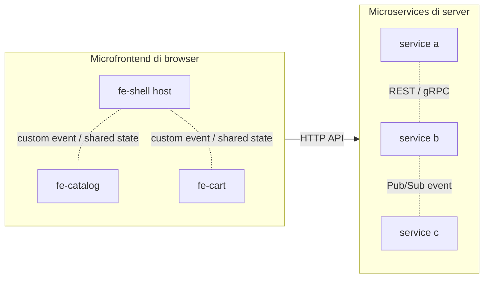

# Terraform Microfrontend

Stack ini bikin satu HTTPS Load Balancer global yang ngehubungin tiga micro frontend di Cloud Run lewat satu domain. Routingnya berdasarkan path jadi semua jalan di origin yang sama dan gak perlu CORS.

```
/             fe-shell
/fe-catalog/  fe-catalog
/fe-cart/     fe-cart
/otel/        otel-collector
```

## Arsitektur


Browser kebuka halaman dari fe-shell terus narik fe-catalog sama fe-cart lewat domain yang sama. RUM SDK di fe-shell ngirim trace ke `/otel/*`, load balancer ngerouting ke collector, collector nerusin ke Cloud Trace dan Cloud Monitoring.

## Yang dibikin sama Terraform

Terraform cuma ngurus sisi load balancer. Service Cloud Run sama Artifact Registry dibangun dan deploy lewat Cloud Build di tiap repo, bukan di sini.

1. Serverless NEG buat tiap service
2. Backend service buat tiap NEG
3. URL map dengan routing per path
4. Managed SSL cert yang nempel ke domain
5. HTTPS proxy plus forwarding rule di port 443
6. Redirect HTTP port 80 ke HTTPS
7. IAM invoker publik biar load balancer bisa nyampe ke service
8. Service account khusus buat OpenTelemetry Collector beserta izin Cloud Trace dan Monitoring

## Sebelum mulai

Pastiin Cloud Run service udah ada (`fe-shell`, `fe-catalog`, `fe-cart`, `otel-collector`) karena Terraform cuma nge-front-in yang udah jalan. Butuh Terraform versi 1.5 ke atas sama akses ke GCP project.

## Cara pakai

Salin file contoh tfvars terus isi sesuai project kamu.

```bash
cp terraform.tfvars.example terraform.tfvars
```

Edit `terraform.tfvars`.

```hcl
project_id = "your-gcp-project"
region     = "asia-southeast2"
domain     = "app.example.com"
```

Jalanin.

```bash
terraform init
terraform plan
terraform apply
```

## Variabel

`project_id` ID GCP project kamu, wajib diisi.

`region` region tempat Cloud Run jalan, default `asia-southeast2` (Jakarta).

`domain` domain publik buat semua micro frontend, wajib diisi.

`enable_apis` nyalain API yang dibutuhin (run dan compute), default `true`.

## Output

`load_balancer_ip` arahin A record DNS domain kamu ke IP ini.

`domain_url` URL publik setelah DNS dan cert siap.

`ssl_cert_name` nama managed cert buat ngecek statusnya.

`otel_collector_url` base URL OTLP yang dipakai RUM SDK di fe-shell.

`otel_collector_sa` service account runtime buat collector.

## Setelah apply

Ambil IP load balancer dari output terus arahin A record domain kamu ke situ. Managed cert butuh waktu sampai aktif setelah DNS ngarah bener. Cek statusnya pakai gcloud.

```bash
gcloud compute ssl-certificates describe <nama-cert> --global --format='value(managed.status)'
```

Begitu statusnya `ACTIVE`, domain udah bisa diakses lewat HTTPS.

## Build dan deploy service

Service Cloud Run dibangun dari `cloudbuild.yaml` di tiap folder, bukan dari Terraform. Perintah di bawah dijalanin dari root repo (satu level di atas folder terraform ini).

Bikin Artifact Registry repo `mfe` dulu kalau belum ada, karena semua image di-push ke situ.

```bash
gcloud artifacts repositories create mfe \
  --repository-format=docker \
  --location=asia-southeast2 \
  --description="Microfrontend images"
```

Build, push, sama deploy tiap service dalam satu perintah.

```bash
gcloud builds submit fe-shell --config=fe-shell/cloudbuild.yaml

gcloud builds submit fe-catalog --config=fe-catalog/cloudbuild.yaml

gcloud builds submit fe-cart --config=fe-cart/cloudbuild.yaml

gcloud builds submit otel-collector --config=otel-collector/cloudbuild.yaml
```

Tiap service punya repo sendiri di GitHub jadi `cloudbuild.yaml` ada di root tiap repo.

```
https://github.com/GDGoC-BiOn/fe-shell
https://github.com/GDGoC-BiOn/fe-catalog
https://github.com/GDGoC-BiOn/fe-cart
```

Kalau mau tiap push langsung kebuild sendiri, bikin trigger per repo.

```bash
gcloud builds triggers create github \
  --name=fe-shell-deploy \
  --repo-name=fe-shell \
  --repo-owner=GDGoC-BiOn \
  --branch-pattern=^main$ \
  --build-config=cloudbuild.yaml

gcloud builds triggers create github \
  --name=fe-catalog-deploy \
  --repo-name=fe-catalog \
  --repo-owner=GDGoC-BiOn \
  --branch-pattern=^main$ \
  --build-config=cloudbuild.yaml

gcloud builds triggers create github \
  --name=fe-cart-deploy \
  --repo-name=fe-cart \
  --repo-owner=GDGoC-BiOn \
  --branch-pattern=^main$ \
  --build-config=cloudbuild.yaml
```

## Microservices vs microfrontend

Biar gak ketuker, dua istilah ini main di lapisan yang beda.

Microservices mecah backend jadi banyak service kecil yang ngurus datanya sendiri. Komunikasinya server ke server, gak kelihatan sama pengguna. Biasanya lewat HTTP REST atau gRPC buat panggilan langsung yang butuh balasan, atau lewat message broker kayak Pub/Sub buat event yang gak nunggu balasan. Tiap service nyimpen state dan databasenya sendiri.

Microfrontend mecah tampilan jadi beberapa aplikasi frontend yang berdiri sendiri, di sini fe-shell, fe-catalog, sama fe-cart. Komunikasinya jalan di browser pengguna, bukan di server. fe-shell jadi host yang manggil dan nempelin fe-catalog sama fe-cart ke halaman. Antar frontend ngobrolnya lewat hal yang ada di browser kayak custom event, props pas modul dipasang, shared state, atau URL.

Di stack ini tiga frontend dilayani dari satu domain lewat load balancer dengan routing per path, jadi semua origin sama dan gak perlu CORS. Bedanya, kalau microservices nuker data antar server, microfrontend nyusun potongan tampilan jadi satu halaman utuh di sisi pengguna.



## Catatan

CI/CD micro frontend diurus sama Cloud Run deploy from repository, bukan Terraform. Makanya di sini sengaja gak ada resource cloudbuild trigger biar gak ada dua trigger yang jalan barengan di push yang sama.
