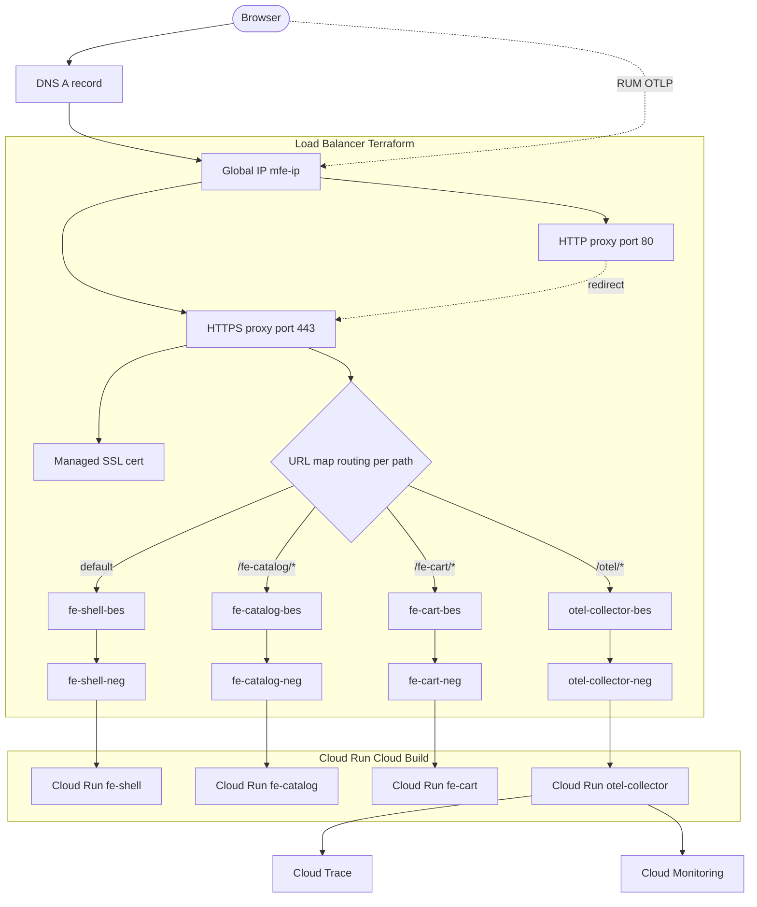

# Terraform Microfrontend

Stack ini bikin satu HTTPS Load Balancer global yang ngehubungin tiga micro frontend di Cloud Run lewat satu domain. Routingnya berdasarkan path jadi semua jalan di origin yang sama dan gak perlu CORS.

```
/             fe-shell
/fe-catalog/  fe-catalog
/fe-cart/     fe-cart
/otel/        otel-collector
```

## Arsitektur



Browser kebuka halaman dari fe-shell terus narik fe-catalog sama fe-cart lewat domain yang sama. RUM SDK di fe-shell ngirim trace ke `/otel/*`, load balancer ngerouting ke collector, collector nerusin ke Cloud Trace dan Cloud Monitoring.

## Yang dibikin sama Terraform

Terraform cuma ngurus sisi load balancer. Service Cloud Run sama Artifact Registry dibangun dan deploy lewat Cloud Build di tiap repo, bukan di sini.

1. Serverless NEG buat tiap service
2. Backend service buat tiap NEG
3. URL map dengan routing per path
4. Managed SSL cert yang nempel ke domain
5. HTTPS proxy plus forwarding rule di port 443
6. Redirect HTTP port 80 ke HTTPS
7. IAM invoker publik biar load balancer bisa nyampe ke service
8. Service account khusus buat OpenTelemetry Collector beserta izin Cloud Trace dan Monitoring

## Sebelum mulai

Pastiin Cloud Run service udah ada (`fe-shell`, `fe-catalog`, `fe-cart`, `otel-collector`) karena Terraform cuma nge-front-in yang udah jalan. Butuh Terraform versi 1.5 ke atas sama akses ke GCP project.

## Cara pakai

Salin file contoh tfvars terus isi sesuai project kamu.

```bash
cp terraform.tfvars.example terraform.tfvars
```

Edit `terraform.tfvars`.

```hcl
project_id = "your-gcp-project"
region     = "asia-southeast2"
domain     = "app.example.com"
```

Jalanin.

```bash
terraform init
terraform plan
terraform apply
```

## Variabel

`project_id` ID GCP project kamu, wajib diisi.

`region` region tempat Cloud Run jalan, default `asia-southeast2` (Jakarta).

`domain` domain publik buat semua micro frontend, wajib diisi.

`enable_apis` nyalain API yang dibutuhin (run dan compute), default `true`.

## Output

`load_balancer_ip` arahin A record DNS domain kamu ke IP ini.

`domain_url` URL publik setelah DNS dan cert siap.

`ssl_cert_name` nama managed cert buat ngecek statusnya.

`otel_collector_url` base URL OTLP yang dipakai RUM SDK di fe-shell.

`otel_collector_sa` service account runtime buat collector.

## Setelah apply

Ambil IP load balancer dari output terus arahin A record domain kamu ke situ. Managed cert butuh waktu sampai aktif setelah DNS ngarah bener. Cek statusnya pakai gcloud.

```bash
gcloud compute ssl-certificates describe <nama-cert> --global --format='value(managed.status)'
```

Begitu statusnya `ACTIVE`, domain udah bisa diakses lewat HTTPS.

## Catatan

CI/CD micro frontend diurus sama Cloud Run deploy from repository, bukan Terraform. Makanya di sini sengaja gak ada resource cloudbuild trigger biar gak ada dua trigger yang jalan barengan di push yang sama.
